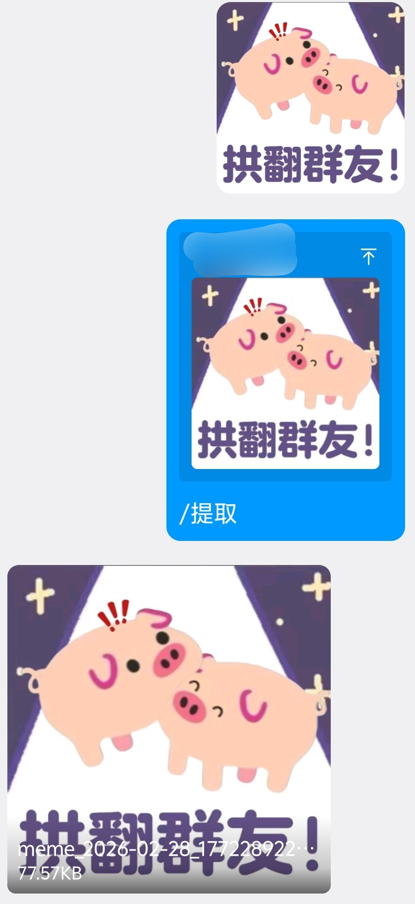
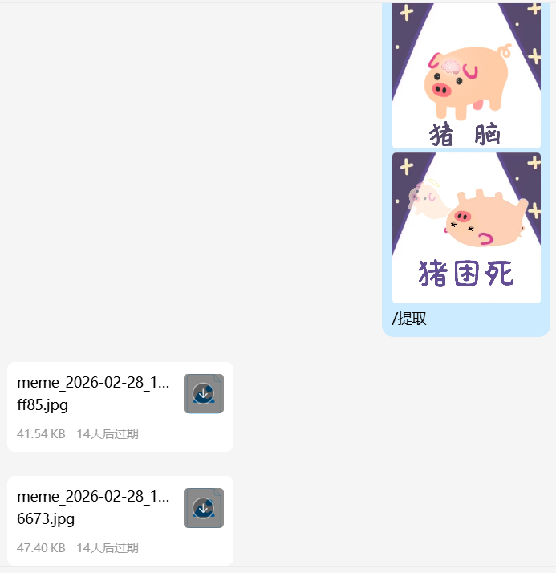

# AstrBot 表情包提取插件

## 功能介绍

这是一个专为 AstrBot 设计的插件，用于将 QQ 表情包提取为可保存的文件格式。
支持直接发送图片或回复包含图片的消息来提取表情包。

## 功能特点

- 支持提取普通表情包和官方表情包
- 支持多种表情包格式（如 JPG、PNG、GIF 等）
- 支持一次性提取多张表情包

## 安装方法

1. 下载最新 [Release](https://github.com/Yangyuwuhan/astrbot_plugin_meme_grabber/releases) 并解压，将插件目录 `astrbot_plugin_meme_grabber` 复制到 AstrBot 的 `data/plugins` 目录下
2. 重启 AstrBot 以加载插件

## 使用说明

1. 引用表情包并使用指令 `/提取`
2. 在回复中包含表情包并使用指令 `/提取`

## 配置选项

插件支持以下配置选项，可在插件管理页面中修改：

| 配置项            | 描述                   | 默认值                                       |
| ----------------- | ---------------------- | -------------------------------------------- |
| temp_dir          | 临时文件保存目录       | data/plugin_data/astrbot_plugin_meme_grabber |
| delete_after_send | 发送后删除临时文件     | true                                         |
| default_extension | 默认提取扩展名         | jpg                                          |
| download_timeout  | 表情包下载超时时间（秒） | 60                                           |

## ⚠ 注意事项

1. 该插件仅支持 QQ 平台（aiocqhttp）
2. 默认提取扩展名指当插件无法识别表情包格式时，输出提取文件所使用的扩展名。若扩展名错误，下载下来把扩展名改成实际即可。

## 声明

1. 本插件的最初构想来源于 [orchidsziyou](https://github.com/orchidsziyou) 的 [astrbot_plugins_ConvetPicture](https://github.com/orchidsziyou/astrbot_plugins_ConvetPicture) 插件，Yangyuwuhan 将整个插件进行了重构和升级
2. 本插件使用了AI，但作者已对其进行了严格的审查和测试
3. 本插件使用 AGPL License

## 相关链接

- [astrbot_plugins_ConvetPicture](https://github.com/orchidsziyou/astrbot_plugins_ConvetPicture)
- [astrbot_plugin_meme_grabber](https://github.com/Yangyuwuhan/astrbot_plugin_meme_grabber)
- [AstrBot](https://astrbot.app)

